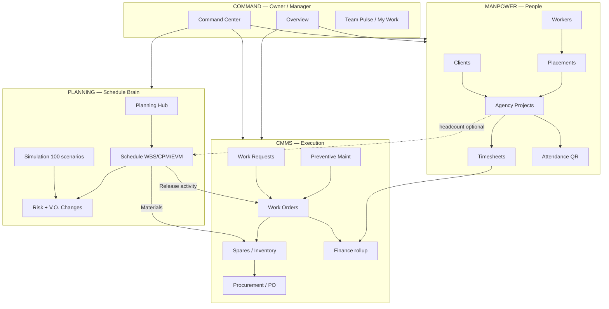

# SaudiChat Pro — Manpower Vertical Master README

> **Industry:** `MANPOWER` (Manpower Agency + CMMS + Planning)  
> **Last updated:** June 2026  
> **Live frontend:** https://saudichat-pro.vercel.app  
> **Live backend:** https://saudichat-pro-production.up.railway.app  
> **Repo:** `saudichat-pro/`

Yeh document **poora system** explain karta hai — kya bana hai, structure kya hai, cheezein kis se link hain, kya link **nahi** hai, aur kaun sa flow kaise chalta hai. Isko kisi developer ya client ko de sakte ho.

---

## 1. Ek Nazar Mein — Yeh Software Kya Hai?

Saudi manpower agency ke liye **4 modules ek login** par:

| Module | Urdu mein | Primavera/SAP jaisa |
|--------|-----------|---------------------|
| **Command** | Owner control room | Executive dashboard |
| **Manpower** | Workers, clients, sites, payroll prep | HR / staffing |
| **Planning** | Shutdown schedule, CPM, simulation, V.O. | Primavera P6 |
| **CMMS** | Maintenance, spares, work orders | SAP PM / Maximo |

**Core idea:** Manpower supply karta hai → Planning schedule banata hai → CMMS execute karta hai → Command sab monitor karta hai.

---

## 2. Sidebar Structure (4 Sections)

Har page: `/dashboard/[businessId]/...`

```
┌─ COMMAND ─────────────────────────────────────────┐
│  Overview              /                          │
│  Command Center        /command-center            │
│  Team Pulse            /my-work                   │
└───────────────────────────────────────────────────┘

┌─ MANPOWER ────────────────────────────────────────┐
│  Client Companies      /clients                   │
│  Projects (sites)      /projects                    │
│  Worker Pool           /workers                   │
│  Placements            /placements                  │
│  Timesheets            /timesheets                  │
│  Manpower Live         /manpower-live             │
│  Attendance            /attendance                │
│  HR Integration        /hr                        │
│  Project Access        /project-access (Owner)    │
│  OT & Policies         /manpower-policy (Owner)   │
└───────────────────────────────────────────────────┘

┌─ PLANNING ────────────────────────────────────────┐
│  Planning Hub          /planning-hub              │
│  Project Planning      /planning                  │
│  What-If Simulation    /planning/simulation       │
│  Risk Intelligence     /planning/risks            │
└───────────────────────────────────────────────────┘

┌─ CMMS ────────────────────────────────────────────┐
│  CMMS Hub              /cmms                      │
│  Equipment & Tools     /equipment                 │
│  Asset Registry        /assets                    │
│  Functional Locations  /locations                 │
│  Work Requests         /work-requests             │
│  Work Orders           /work-orders               │
│  Work Planner (7-day)  /planner                   │
│  Preventive Maint.     /maintenance               │
│  Spares & Stores       /spares                    │
│  Procurement           /procurement               │
│  CMMS Finance          /finance                   │
│  AI Engine             /ai-engine                 │
│  Notification Center   /notifications             │
│  CMMS Security         /security                  │
└───────────────────────────────────────────────────┘

Footer: Help · Settings · Billing
```

**Config file:** `frontend/src/lib/manpower-sidebar-nav.ts`

---

## 3. Master System Flowchart



---

## 4. 3-Level Roles (Owner → Office → Site)

| Level | App Role | Kya karta hai |
|-------|----------|---------------|
| **Owner** | `OWNER` | Command Center, CMMS Hub summary, procurement approve, policy, billing, project access |
| **Office** | `MANAGER`, `OFFICE_STAFF` | Projects, planning, CMMS control, timesheets, work orders create |
| **Site** | `FIELD_WORKER` | Work requests, assigned WOs, attendance, own timesheets |

**CMMS master execution flow:**
```
Asset/Location → Work Request → Office Approve → Work Order → Site Execute
     → Issue Spare Parts → Inventory ↓ → Owner sees cost in CMMS Hub / Finance
```

**Manpower master flow:**
```
Client → Agency Project (site) → Placement (worker assign) → Timesheet → Approve → Export/Payroll prep
```

**Planning master flow:**
```
Program → Schedule Project → WBS → Activities → Dependencies → CPM
     → Baseline → Progress % → EVM (SPI/CPI)
     → V.O. Change → Re-baseline → Release → Work Order
```

---

## 5. Database Models — Kya Kahan Store Hota Hai

### Manpower models

| Model | Table | Kya store karta hai |
|-------|-------|---------------------|
| `ClientCompany` | ClientCompany | Aramco, SABIC, etc. |
| `AgencyProject` | AgencyProject | Site: GPS, headcount, manager, dates |
| `WorkerProfile` | WorkerProfile | Pool: iqama, skills, QR token |
| `Placement` | Placement | Worker → client → project |
| `Timesheet` | Timesheet | Hours, OT, approval status |
| `WorkerDailyAttendance` | WorkerDailyAttendance | Daily present/absent |
| `ProjectMemberAccess` | ProjectMemberAccess | Manager permissions per project |
| `AgencyEquipment` | AgencyEquipment | Tools kanban board |

### CMMS models

| Model | Kya store karta hai |
|-------|---------------------|
| `FunctionalLocation` | Location tree (HQ → Site) |
| `WorkRequest` | Fault reports from site |
| `WorkOrder` | Corrective / preventive / planned jobs |
| `MaintenancePlan` | PM calendar schedule |
| `SparePart` | MRO stock + reorder point |
| `InventoryTransaction` | ISSUE / RECEIPT stock moves |
| `WorkOrderPart` | Parts issued to WO |
| `PurchaseRequisition` | Low stock purchase request |
| `PurchaseOrder` | PO to vendor |
| `CmmsFinanceConfig` | Budget, GL account (simulated ERP) |

### Planning models

| Model | Kya store karta hai |
|-------|---------------------|
| `Program` | Portfolio (e.g. Shutdown 2026) |
| `ScheduleProject` | Schedule + calendar + penalty/day |
| `WbsNode` | WBS tree |
| `ScheduleActivity` | Tasks + cost + progress % |
| `ActivityDependency` | FS/SS/FF/SF links |
| `ActivityResource` | Trade / worker on activity |
| `ActivityMaterial` | Spare part on activity |
| `ScheduleBaseline` | Baseline snapshot JSON |
| `ScheduleChangeOrder` | V.O. — scope change + approval |

**Schema file:** `backend/prisma/schema.prisma`  
**SQL sync (production):** `backend/scripts/sync-schema.sql` or `backend/scripts/critical-manpower.sql`

---

## 6. Module-by-Module — Point to Point

### 6.1 COMMAND

#### Overview `/dashboard/[businessId]`
- **Kya hai:** Agency stats — active projects, on-site today, equipment preview
- **Links:** → Projects, Equipment, CMMS demo banner
- **API:** Business dashboard endpoints
- **Role:** Owner+

#### Command Center `/command-center`
- **Kya hai:** AI morning briefing, hidden risk score, reminders, **Ask Company Anything**
- **Links:** Reads manpower (iqama, timesheets), CMMS alerts, **planning critical path** alerts
- **API:** `GET .../owner-briefing`, `POST .../ask-company`
- **Service:** `executiveBriefingService.ts`
- **Gap:** Schedule Compliance / MTBF top KPIs abhi limited — mostly manpower-oriented

#### Team Pulse `/my-work`
- **Kya hai:** Owner = full team view; staff = own tasks
- **Links:** Timesheets pending, work orders assigned
- **API:** `GET .../manpower/team-pulse`

---

### 6.2 MANPOWER

#### Clients `/clients`
- **Function:** CRUD client companies (oil & gas clients)
- **API:** `GET/POST .../manpower/clients`
- **Links:** → Projects (har project ek client se link)

#### Projects `/projects` + `/projects/[id]`
- **Function:** Site/project register — headcount, GPS, manager, dates
- **API:** `GET/POST/PATCH/DELETE .../manpower/projects`
- **Links:**
  - ✅ → Placements (workers on this site)
  - ✅ → Timesheets, Attendance
  - ✅ → Project Access (manager permissions)
  - ⚠️ → Planning `ScheduleProject.agencyProjectId` (optional — manual link, UI limited)
  - ❌ → CMMS WorkOrder.projectId (partial — WO can link but not auto from project page)

#### Workers `/workers`
- **Function:** Worker pool, categories, iqama expiry
- **API:** `GET/POST .../manpower/workers`, QR: `GET .../workers/:id/qr`
- **Links:**
  - ✅ → Placements
  - ✅ → QR check-in `/check-in/[token]`
  - ⚠️ → Planning ActivityResource (API hai, UI kam)

#### Placements `/placements`
- **Function:** Assign worker to client + project
- **API:** `GET/POST/PATCH/DELETE .../manpower/placements`
- **Links:** Worker + AgencyProject — **core manpower link**

#### Timesheets `/timesheets`
- **Function:** Hours entry, approval workflow, Excel import/export
- **Flow:**
  ```
  Office submits → PENDING → Manager → PENDING_ADMIN → APPROVED → BILLED
  ```
- **API:** `GET/POST/PATCH .../timesheets`, bulk-action, export, import
- **Links:**
  - ✅ → Manpower Policy (OT rules)
  - ✅ → Project
  - ❌ → Finance payroll system (export only, no SAP payroll)
  - ❌ → Planning progress auto-update

#### Attendance `/attendance` + QR `/check-in/[token]`
- **Function:** Site attendance, optional GPS
- **Links:** ✅ Worker, ✅ Project daily attendance
- **Gap:** ❌ Mobile native app, ❌ Planning progress feed

#### HR Integration `/hr`
- **Function:** Simulated HR sync (config + seed)
- **Gap:** ❌ Real SAP SuccessFactors / Oracle HCM API

#### Project Access `/project-access` (Owner)
- **Function:** Drag-drop manager permissions per project
- **API:** `GET/PUT/DELETE .../projects/:id/access`

#### Manpower Policy `/manpower-policy` (Owner)
- **Function:** OT multiplier, approval stages
- **Links:** ✅ Timesheet calculations

#### Equipment `/equipment`
- **Function:** Kanban — STOCK → ISSUED → INSPECTION → MAINTENANCE
- **API:** `.../manpower/equipment/*`
- **Links:** ✅ Overview preview
- **Gap:** ❌ Separate from CMMS Asset Registry (2 parallel asset systems)

---

### 6.3 PLANNING

#### Planning Hub `/planning-hub`
- **Function:** Entry — stats, demo load, quick links
- **API:** `GET .../planning/dashboard`

#### Project Planning `/planning`
- **Tabs:** Schedule | Create | EVM | V.O./Changes | AI | Resources
- **Functions:**
  - WBS + Gantt + CPM critical path
  - Dependencies FS/SS/FF/SF
  - Baseline + variance
  - Drag Gantt (shift/resize)
  - Progress % → **EVM recalc**
  - CSV/XER-lite import
  - Release activity → **Work Order**
  - **EVM:** BAC, BCWS, BCWP, ACWP, SPI, CPI, SV, CV, EAC
  - **V.O.:** DRAFT → PENDING → APPROVED → new baseline
- **API:** Full `/planning/*` routes (see section 8)

#### Simulation `/planning/simulation`
- **Function:** Worker shortage, material delay, crane delay, combined, **100 scenarios batch**
- **Output:** Slip days + cost increase SAR

#### Risk `/planning/risks`
- **Function:** Delay probability %, SAR impact, resource overload preview

**Planning links:**

| From | To | Status |
|------|-----|--------|
| Schedule Activity | Work Order | ✅ Release button |
| Activity Material | SparePart stock | ✅ On release (if stock) |
| Schedule Project | Agency Project | ⚠️ Optional field |
| Activity Resource | Worker Profile | ⚠️ API only |
| Progress % | Timesheet actual hours | ❌ Not linked |
| EVM ACWP | CMMS Finance actual | ❌ Partial (WO complete helps) |
| Planning | Command Center Gantt | ❌ Separate views |

---

### 6.4 CMMS

#### CMMS Hub `/cmms`
- **Function:** Owner summary — assets, open WR/WO, PM due, cost, downtime
- **API:** `GET .../cmms/dashboard`

#### Locations `/locations`
- **Function:** Functional location tree
- **Links:** ✅ Assets, ✅ Work Orders

#### Assets `/assets`
- **Function:** Asset register (CMMS-grade)
- **Gap:** ⚠️ Equipment board (`/equipment`) alag system — **not fully merged**

#### Work Requests `/work-requests`
- **Function:** Site fault reports
- **Flow:** Site creates → Office approves → converts to WO
- **Links:** ✅ → Work Orders

#### Work Orders `/work-orders`
- **Function:** Execute maintenance jobs
- **Links:**
  - ✅ ← Planning (release activity)
  - ✅ ← PM plans (run-due)
  - ✅ → Spares (issue part)
  - ✅ → Planner (schedule day)
  - ⚠️ → Agency Project (field exists)

#### Work Planner `/planner`
- **Function:** 7-day WO drag-drop board (execution scheduling)
- **Note:** **Not** Primavera Gantt — short-term WO calendar only

#### Preventive Maintenance `/maintenance`
- **Function:** PM plans, run-due → auto WO
- **Gap:** ❌ Meter/condition-based PM (calendar only)

#### Spares `/spares`
- **Function:** Stock, reorder point, add parts
- **Links:** ✅ WO issue, ✅ Planning materials, ✅ Procurement

#### Procurement `/procurement`
- **Function:** Requisitions → PO list → advance status
- **Gap:** ❌ Vendor bills / GRN / 3-way match

#### Finance `/finance`
- **Function:** Budget vs actual chart, simulated ERP sync
- **Gap:** ❌ Real SAP GL; ❌ Full link to Planning EVM

#### AI Engine `/ai-engine`
- **Function:** Failure prediction (rules), spare demand forecast
- **Gap:** ❌ Real IoT/ML

#### Notifications `/notifications`
- **Function:** Email/SMS/WhatsApp config (test mode)

#### Security `/security`
- **Function:** CMMS role per member

---

## 7. Link Matrix — Kya Kis Se Connected Hai

| A | B | Link Type | Status |
|---|---|-----------|--------|
| ClientCompany | AgencyProject | FK clientCompanyId | ✅ |
| WorkerProfile | Placement | FK | ✅ |
| AgencyProject | Placement | FK projectId | ✅ |
| AgencyProject | Timesheet | FK | ✅ |
| AgencyProject | ScheduleProject | optional agencyProjectId | ⚠️ Manual |
| Placement | Planning resource pool | read headcount | ⚠️ |
| ScheduleActivity | WorkOrder | release → workOrderId | ✅ |
| ActivityMaterial | SparePart | FK + issue on release | ✅ |
| WorkOrder | WorkOrderPart | issue spare | ✅ |
| WorkOrder | InventoryTransaction | ISSUE | ✅ |
| PurchaseRequisition | PurchaseOrder | approve flow | ✅ |
| PM Plan | WorkOrder | run-due | ✅ |
| WorkOrder | Planner board | schedule date | ✅ |
| Timesheet | Manpower Policy | OT rules | ✅ |
| Timesheet | External payroll | export Excel | ⚠️ Manual |
| Planning EVM | CMMS Finance | shared concept | ❌ Siloed |
| Progress % | Timesheet hours | — | ❌ |
| QR Attendance | Planning schedule | — | ❌ |
| Equipment board | CMMS Assets | — | ❌ Parallel |
| Worker | WorkOrder assign | assignedMemberId | ⚠️ Partial |
| V.O. approved | Baseline | auto snapshot | ✅ |
| Command Center | All modules | alerts read | ⚠️ Partial |

**Legend:** ✅ Working · ⚠️ Partial/manual · ❌ Not built

---

## 8. Backend API Quick Reference

### Manpower base: `/api/businesses/:businessId/manpower/`

| Path | Method | Function |
|------|--------|----------|
| `/clients` | GET/POST | Client CRUD |
| `/projects` | GET/POST/PATCH/DELETE | Site projects |
| `/projects/:id/attendance` | GET/PUT | Daily attendance |
| `/projects/:id/access` | GET/PUT/DELETE | Manager permissions |
| `/workers` | GET/POST | Worker pool |
| `/workers/:id/qr` | GET | QR code |
| `/placements` | GET/POST/PATCH/DELETE | Assignments |
| `/timesheets` | GET/POST/PATCH | Timesheets |
| `/timesheets/pending` | GET | Approval queue |
| `/timesheets/bulk-action` | POST | Bulk approve |
| `/timesheets/export` | GET | Excel export |
| `/timesheets/import` | POST | Excel import |
| `/policy` | GET/PATCH | OT policy |
| `/equipment` | GET/POST/PATCH/DELETE | Tools kanban |
| `/team-pulse` | GET | Team dashboard |
| `/live-dashboard` | GET | Live stats |
| `/analytics` | GET | Analytics |
| `/hr/*` | GET/PATCH/POST | HR integration stub |
| `/seed-demo` | POST | Load demo |
| `/sync-schema` | POST | DB fix |
| `/reports/ceo-pdf` | GET | CEO PDF |

### CMMS base: `/api/businesses/:businessId/cmms/`

See `MANPOWER-MODULE-STATUS.md` section C + finance, ai-engine, notifications, security, planner, purchase-orders.

### Planning base: `/api/businesses/:businessId/planning/`

| Path | Function |
|------|----------|
| `/dashboard` | Planning hub stats |
| `/programs` | Portfolio programs |
| `/projects` | Schedule projects |
| `/projects/:id` | Full detail + EVM |
| `/projects/:id/wbs` | WBS nodes |
| `/projects/:id/activities` | Activities |
| `/projects/:id/dependencies` | CPM links |
| `/projects/:id/baseline` | Save baseline |
| `/projects/:id/recalculate` | Run CPM |
| `/projects/:id/simulate` | What-if single |
| `/projects/:id/simulate-batch` | Up to 100 scenarios |
| `/projects/:id/risk-report` | Risk intelligence |
| `/projects/:id/change-orders` | V.O. list/create |
| `/projects/:id/evm` | EVM metrics |
| `/projects/:id/import` | CSV import |
| `/activities/:id/release` | → Work Order |
| `/change-orders/:id` PATCH | submit/approve/reject |
| `/seed` | Demo shutdown |

---

## 9. End-to-End Example — Shutdown Turnaround

```
1. MANPOWER
   Client: SABIC → Project: Jubail Shutdown → 50 workers placed

2. PLANNING
   Planning Hub → Load Demo (Shutdown 2026)
   WBS: MECH/ELEC/INST → Activities + dependencies
   Set Baseline → EVM baseline BCWS

3. SIMULATION
   "5 welders kam + material 7d late" → +12d slip, +450K SAR

4. RISK
   Critical activities HIGH risk → Command Center alert

5. CLIENT SCOPE CHANGE
   V.O. create → Submit → Approve → New baseline "After VO-001"

6. EXECUTION
   Activity "Overhaul Pump" → Release → WO-1042 (CMMS)
   Work Planner → schedule WO on Tuesday
   Issue spare parts from Spares page
   Field worker completes WO → Progress % 100%

7. EVM
   Planning → EVM tab → SPI/CPI update
   BCWP vs ACWP → CPI shows cost performance

8. FINANCE
   CMMS Finance → maintenance cost rollup
   Timesheets → approved → Excel export for payroll

9. OWNER
   Command Center → briefing + CMMS Hub → total cost
```

---

## 10. Jo Link NAHI Hai (Honest Gaps)

### ❌ Completely missing

| Feature | Should link with | Why needed |
|---------|------------------|------------|
| HSE / Permits | WO, Planning | Saudi site safety |
| IoT sensors | AI Engine, Assets | Predictive maint |
| Digital Twin | Planning + CMMS | Plant 3D |
| Native mobile app | Attendance, WO | Field use |
| Real SAP/Primavera API | Finance, Planning | Enterprise clients |
| Vendor bills (AP) | Procurement PO | Full MM module |
| Payroll system | Timesheets | Auto pay |
| Condition monitoring | PM plans | Meter-based PM |

### ⚠️ Partial / manual link

| Gap | Detail |
|-----|--------|
| Agency Project ↔ Schedule Project | DB field hai, UI link button kam |
| Equipment board ↔ CMMS Assets | Do alag asset lists |
| Planning progress ↔ Timesheet | Dono alag update |
| EVM ACWP ↔ CMMS Finance | Dono alag cost engines |
| Worker ↔ WO assignment | Basic member assign |
| QR attendance ↔ Planning | Attendance planning affect nahi karta |
| Command Center ↔ Planning Gantt | Alag pages |
| Procurement ↔ email vendor | PO status manual advance |

---

## 11. Errors / Issues — Kya Ho Sakta Hai

| Error | Cause | Fix |
|-------|-------|-----|
| "Database tables need one-time update" | Neon schema old | Run `critical-manpower.sql` in Neon SQL Editor |
| Planning page empty | No demo / no tables | Planning Hub → Load demo |
| SPI/CPI shows 1.0 always | No progress % entered | Schedule tab → save Progress % |
| Release WO fails | DB or missing project | Check sync-schema |
| 503 on create project | AgencyProject columns missing | `POST .../sync-schema` or SQL |
| EVM ACWP low accuracy | WO not marked COMPLETED | Complete WO in CMMS |
| V.O. approve fails | `schedule_change_orders` table missing | Run SQL last section |

**Railway:** Set `DIRECT_URL` (Neon non-pooler) for auto schema sync on deploy.

---

## 12. Key Files (Developer Map)

```
frontend/
  src/lib/manpower-sidebar-nav.ts    ← 4 sections sidebar
  src/lib/industry-config.ts         ← Nav keys + roles
  src/lib/cmms-config.ts             ← Owner/Office/Site levels
  src/lib/api.ts                     ← All API calls
  src/app/dashboard/[businessId]/    ← All pages

backend/
  src/routes/index.ts                ← All routes
  src/controllers/workforceController.ts   ← Manpower
  src/controllers/cmmsController.ts        ← CMMS
  src/controllers/planningController.ts    ← Planning
  src/services/planningService.ts          ← CPM engine
  src/services/planningEvmService.ts       ← EVM BCWP/BCWS/ACWP
  src/services/planningSimulationService.ts
  src/services/planningChangeService.ts    ← V.O.
  src/services/executiveBriefingService.ts ← Command Center
  prisma/schema.prisma                     ← All models
  scripts/sync-schema.sql                  ← Full DB migration
  scripts/critical-manpower.sql            ← Quick DB fix
```

---

## 13. Demo Data — Kahan Se Load Karein

| Demo | Button location | Kya aata hai |
|------|-----------------|--------------|
| Manpower | Overview / Projects → Load demo | Clients, projects, workers, placements, timesheets |
| CMMS | CMMS Hub → Load CMMS demo | Locations, assets, WR, WO, PM, spares |
| Planning | Planning Hub → Load demo | Shutdown 2026, 8 activities, CPM, baseline |

---

## 14. Role → Pages Summary

| Role | Manpower | Planning | CMMS |
|------|----------|----------|------|
| OWNER | All + policy + access | All | All + finance approve |
| MANAGER | All except billing | All | All except billing |
| OFFICE_STAFF | WR, WO, timesheets, projects | Limited | WR, WO, spares |
| FIELD_WORKER | My work, WR, timesheets | — | WR, assigned WO |

---

## 15. Completion Estimate (June 2026)

| Module | % | Notes |
|--------|---|-------|
| Manpower core | ~90% | Clients → payroll prep strong |
| CMMS core | ~80% | WO, PM, spares, procurement |
| Planning | ~90% | CPM, EVM, simulation, V.O. |
| Command Center | ~70% | Manpower-heavy KPIs |
| Cross-module links | ~50% | Many silos remain |
| HSE / IoT / Mobile | ~5% | Not built |
| Real ERP | ~10% | Simulated only |

**Overall product (Manpower vertical): ~75%** — strong for demo and pilot; enterprise needs ERP + mobile + HSE.

---

## 16. Quick Test Checklist

- [ ] Login → Manpower business
- [ ] Settings → Fix Database (or Neon SQL)
- [ ] Load all 3 demos (Manpower, CMMS, Planning)
- [ ] Create placement → timesheet → approve
- [ ] Work request → work order → issue spare
- [ ] Planning → progress % → EVM tab SPI/CPI
- [ ] Simulation → 100 scenarios
- [ ] V.O. → approve → check new baseline
- [ ] Release activity → WO appears in CMMS
- [ ] Command Center → Ask Company Anything

---

*Is file ko `MANPOWER-MODULE-STATUS.md` (short list) aur `MANPOWER-BACKTESTING-GUIDE.md` (test steps) ke sath use karo.*
